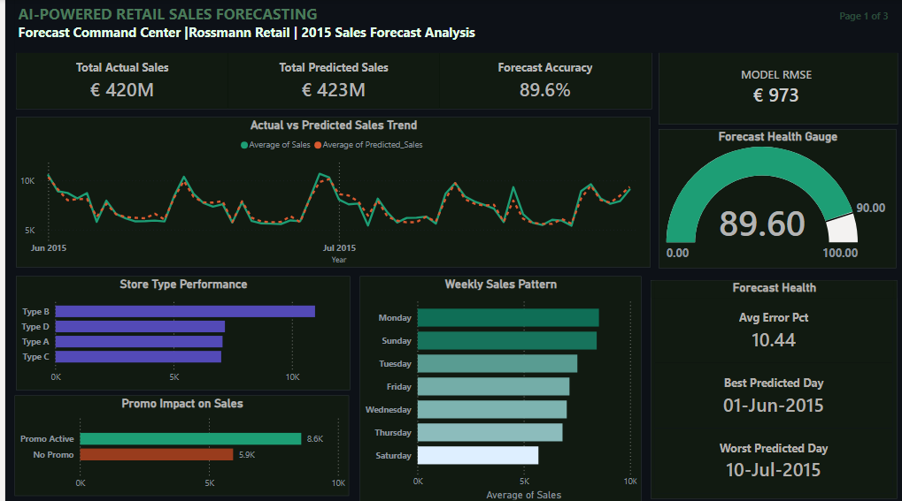
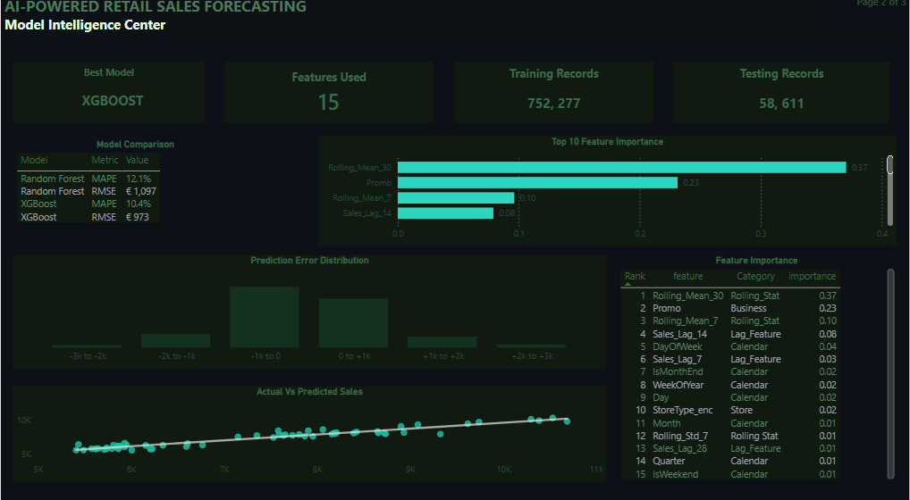

# 🛒 Rossmann Retail Sales Forecasting

>Predicting daily store sales across 1,115 Rossmann stores using machine learning through a comparison of Random Forest and XGBoost models trained on 810,888 historical trading records, with insights delivered in a 3-page interactive Power BI dashboard.

---

## 📄 Executive Summary

Developed an end-to-end retail sales forecasting pipeline using Python, XGBoost, and Power BI. The solution achieved **89.6% forecast accuracy**, reducing RMSE by **€124 per store per day** compared with a Random Forest baseline, while delivering an interactive three-page dashboard for business users.

---

## 📌 Project Overview

Rossmann operates over 3,000 drug stores across Europe. Store managers submit sales forecasts up to six weeks in advance to support staffing, inventory planning, and promotional decisions. Inaccurate forecasts can lead to overstocking, which increases costs, or understocking, which causes lost revenue.

This project builds a machine learning forecasting pipeline to predict daily store sales during the June to July 2015 test period. The model uses two years of historical sales data, store attributes, promotional activity, and engineered time-series features.

**Business Question:** *Can machine learning accurately forecast daily store sales using historical sales patterns, promotional activity, and store characteristics to improve operational planning?*

---

## 📊 Dashboard Preview

The analysis is delivered through a 3-page interactive Power BI dashboard:

| Page | Focus |
|---|---|
| **Page 1: Forecast Command Center** | Forecast accuracy, actual vs predicted sales trend, weekly sales patterns, and promo impact |
| **Page 2: Model Intelligence Center** | Random Forest vs XGBoost comparison, feature importance, error distribution, and prediction scatter plot |
| **Page 3: Store Performance Intelligence** | Top stores, store type breakdown, competition impact, promo effectiveness, and sales seasonality |

### 📍 Page 1: Forecast Command Center



---

### 📍 Page 2: Model Intelligence Center



---

### 📍 Page 3: Store Performance Intelligence


**Key Results at a Glance:**
- ✅ Forecast Accuracy: **89.6%**
- 📉 XGBoost RMSE: **€973 per store per day**
- 📉 XGBoost MAPE: **10.4%**
- 🏆 Best Predicted Day: **01-Jun-2015**
- 📅 Test Period: **June to July 2015**
---

## 📁 Repository Structure

```
rossmann-sales-forecasting/
│
├── data/
│   ├── train.csv
│   ├── store.csv
│   ├── sales_features.csv
│   ├── sales_predictions.csv
│   └── feature_importance.csv
│
├── notebooks/
│   ├── 01_data_exploration.ipynb
│   ├── 02_feature_engineering.ipynb
│   └── 03_modelling.ipynb
│
├── dashboard/
│   └── sales_forecating_dashboard.pbix
│
├── visuals/
│   ├── page1_forecast_command_center.png
│   ├── page2_model_intelligence_center.png
│   ├── page3_store_performance_center.png
│   ├── sales_by_day.png
│   ├── monthly_sales_trend.png
│   ├── sales_by_store_type.png
│   ├── promo_impact.png
│   ├── feature_importance.png
│   └── actual_vs_predicted.png
│
├── README.md

```


---

## 🗂️ Dataset

**Source:** [Rossmann Store Sales — Kaggle](https://www.kaggle.com/c/rossmann-store-sales)

| Dataset / Stage | Records | Description |
|---|---:|---|
| `train.csv` | 1,017,209 | Raw daily sales records from 2013 to 2015 |
| `store.csv` | 1,115 | Store-level attributes, including store type, competition distance, and promo details |
| Open trading days | 844,338 | Records after removing closed stores and zero-sales days |
| Final modelling dataset | **810,888** | Records after creating lag and rolling features and removing missing history rows |

**Key columns used:**
- `Sales`: Daily revenue per store and the target variable
- `Store`: Unique store identifier from 1 to 1,115
- `DayOfWeek`: Trading day, where 1 = Monday and 7 = Sunday
- `Promo`: Indicates whether a promotion was active
- `StoreType`: Store format category, including A, B, C, and D
- `CompetitionDistance`: Distance to the nearest competitor in metres
  
---
## 🔧 Feature Engineering

Features were engineered to capture historical sales behaviour, recent sales momentum, seasonality, and store-level business signals.

### Lag Features

Lag features capture previous sales for the same store and help the model learn short-term sales patterns.

| Feature | Description |
|---|---|
| `Sales_Lag_7` | Sales from 7 previous trading records |
| `Sales_Lag_14` | Sales from 14 previous trading records |
| `Sales_Lag_28` | Sales from 28 previous trading records |

### Rolling Statistics

Rolling features smooth daily fluctuations and capture recent sales momentum.

| Feature | Description |
|---|---|
| `Rolling_Mean_7` | Average sales over the previous 7 trading records |
| `Rolling_Mean_30` | Average sales over the previous 30 trading records |
| `Rolling_Std_7` | Sales variability over the previous 7 trading records |

### Calendar Features

Calendar features capture seasonality, weekly patterns, and business timing effects.

`Year`, `Month`, `Day`, `WeekOfYear`, `Quarter`, `DayOfWeek`, `IsWeekend`, `IsMonthStart`, `IsMonthEnd`

### Encoded Categorical Features

Categorical store and holiday variables were label encoded for tree-based modelling.

`StoreType_enc`, `Assortment_enc`, `StateHoliday_enc`

**Total features used in model: 23**

> > ⚠️ **Leakage Prevention:** To prevent data leakage, all lag and rolling features were generated using `.shift(1)` before computing rolling statistics. This guarantees that every prediction relies exclusively on information available prior to the prediction date.
---

## 🤖 Modelling

### Train/Test Split Strategy

A **time-based split** was used instead of a random split to reflect how forecasting works in production. Training on future data would cause data leakage and artificially inflate performance metrics.

| Split | Date Range | Records |
|---|---|---:|
| Training | Jan 2013 to May 2015 | 752,277 |
| Testing | Jun 2015 to Jul 2015 | 58,611 |

### Models Trained

**1. Random Forest Regressor** (baseline)
```python
RandomForestRegressor(
    n_estimators=100,
    max_depth=10,
    min_samples_leaf=10,
    random_state=42,
    n_jobs=-1
)
```

**2. XGBoost Regressor** (final model)
```python
XGBRegressor(
    n_estimators=300,
    max_depth=6,
    learning_rate=0.05,
    subsample=0.8,
    colsample_bytree=0.8,
    random_state=42,
    n_jobs=-1
)
```

---

## 📈 Results

| Model | RMSE | MAPE | Accuracy |
|---|---:|---:|---:|
| Random Forest | €1,097 | 12.1% | 87.9% |
| **XGBoost** | **€973** | **10.4%** | **89.6%** |

**XGBoost outperformed Random Forest by:**
- RMSE improvement: **€124 per store per day**
- MAPE improvement: **1.7 percentage points**

### Top 5 Most Important Features

| Rank | Feature | Category | Importance |
|---:|---|---|---:|
| 1 | `Rolling_Mean_30` | Rolling statistic | 0.37 |
| 2 | `Promo` | Business feature | 0.23 |
| 3 | `Rolling_Mean_7` | Rolling statistic | 0.10 |
| 4 | `Sales_Lag_14` | Lag feature | 0.08 |
| 5 | `DayOfWeek` | Calendar feature | 0.04 |

> **Insight:** Rolling statistics were the strongest predictors of future sales, showing that recent sales momentum is highly important. Promotional activity was also a major driver, making it the most influential business-controlled feature.
---

## 💼 Business Impact

| Finding | Business Implication |
|---|---|
| 89.6% forecast accuracy | The model provides a reliable forecasting baseline for staffing, inventory, and promotion planning |
| Promo is the #2 most important feature | Promotional activity has a measurable impact on predicted sales performance |
| Rolling 30-day average is the #1 feature | Recent sales momentum is more predictive than calendar timing alone |
| Store Type B records the highest average sales | Store format appears to influence revenue potential |
| Stores closer to competitors tend to underperform | Competitive proximity may create revenue pressure and should be considered in site planning |
| XGBoost reduced RMSE by €124 per store per day | Across 1,115 stores and the test period, this represents a substantial reduction in aggregate forecast error compared with Random Forest |

---

## ⚠️ Limitations

- The model is based on historical sales patterns and may not fully account for unexpected events such as supply disruptions, economic shocks, or sudden changes in customer behavior.
- External factors such as weather, local events, competitor promotions, and macroeconomic indicators were not included in the feature set.
- The model was evaluated on a two-month holdout period, so performance may vary across longer forecasting horizons or future business conditions.
- The model may require periodic retraining to remain accurate as customer behavior, store operations, and promotional strategies change over time.

## 🚀 Future Improvements

- Incorporate external features such as holiday calendars, weather data, local events, and competitor promotions.
- Evaluate additional gradient boosting models such as LightGBM and CatBoost.
- Deploy the trained model as a REST API using FastAPI.
- Automate model retraining with a scheduled pipeline to keep forecasts up to date.

## 🛠️ Tools & Technologies

| Tool | Purpose |
|---|---|
| Python | Data cleaning, feature engineering, and model development |
| pandas / NumPy | Data manipulation and numerical operations |
| scikit-learn | Random Forest modelling, model evaluation, and performance metrics |
| XGBoost | Final gradient boosting forecasting model |
| Matplotlib | Exploratory data analysis and model visualisations |
| Seaborn | Statistical data visualisation and exploratory analysis |
| Power BI | Interactive 3-page business intelligence dashboard |
| DAX | KPI measures, calculated columns, and dashboard logic |

## 🎯 Skills Demonstrated

- Data Cleaning
- Exploratory Data Analysis
- Feature Engineering
- Time-Series Forecasting
- Machine Learning Modelling
- Model Evaluation
- Model Interpretation
- Power BI Dashboard Development
- DAX Measures and Calculated Columns
- Business Insight Communication


## ▶️ How to Run

### 1. Clone the repository
```bash
git clone https://github.com/Cephasadamskumah-ds2025/rossmann-sales-forecasting.git
cd rossmann-sales-forecasting
```

### 2. Install dependencies
```bash
pip install pandas numpy scikit-learn xgboost matplotlib seaborn
```

### 3. Download the dataset
Download `train.csv` and `store.csv` from [Kaggle](https://www.kaggle.com/c/rossmann-store-sales) and place them in the `data/` folder.

### 4. Run notebooks in order
```
01_data_exploration.ipynb   → understand the data
02_feature_engineering.ipynb → create features, saves sales_features.csv
03_modelling.ipynb           → train models, saves sales_predictions.csv
```

### 5. Open the dashboard
Open `dashboard/sales_forecasting_dashboard.pbix` in Power BI Desktop and refresh the data source to point to your local `sales_predictions.csv` and `feature_importance.csv` files.

---

## 🔑 Key Learnings

- **Time-based splits matter:** Random splits in time-series forecasting can cause data leakage and inflate test performance.
- **Lag features are powerful predictors:** A store’s recent sales history is often more predictive than calendar variables alone.
- **Leakage prevention requires explicit shifting:** Rolling features must use `.shift(1)` before window calculations to avoid
    including the current day’s sales.
- **RMSE and MAPE serve different purposes:** RMSE penalizes large errors more heavily, while MAPE is easier for business stakeholders to interpret.
- **Tree-based models do not require scaling:** Random Forest and XGBoost can work directly with raw numeric features.
- **Promotional impact is measurable:** The model identified promotion status as one of the strongest business-controlled drivers of sales.

---

## 👤 Author

**Cephas Adams Kumah**
| Data Science Graduate | Healthcare & Retail Analytics
[LinkedIn](https://linkedin.com/in/Cephas-Adams-Kumah) · [GitHub](https://github.com/Cephasadamskumah-ds2025) · 

---

## 📄 Licence

This project uses publicly available data from Kaggle under their competition terms. Code is released under the MIT Licence.
